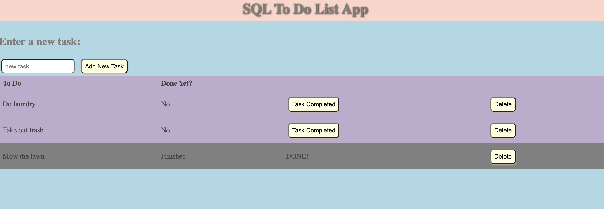

# PROJECT NAME
SQL To-Do List
## Description

_Duration: 5 hours_

This application is a to-do list generator.  The application accepts a new task to do as an input, then adds it to a task list when the "add new task" button is clicked.  Additional functionality allows the user to mark tasks as "completed" or to delete the task from the DOM.  I solved this problem by using ajax routes and SQL queries from each aspect of the 'CRUD'framework:
C- Create: Post route, Insert query
R- Read: Get route, Select query
U- Update: Put route, Update query
D- Delete: Delete route, Delete query

## Screen Shot

### Prerequisites

Link to software that is required to install the app (e.g. node).

- [Node.js](https://nodejs.org/en/)

## Installation

1. Create a database named `weekend-to-do-app`,
2. The queries in the `database.sql` file are set up to create all the necessary tables and populate the needed data to allow the application to run correctly. The project is built on [Postgres](https://www.postgresql.org/download/), so you will need to make sure to have that installed. We recommend using Postico to run those queries as that was used to create the queries, 
3. Open up your editor of choice and run an `npm install`
4. Run `npm install "pg"` in your terminal
5. Run `npm init -y` in your terminal
6. Run `npm start` in your terminal
7. In your browser, go to `localhost:5000`

## Usage

1. Enter the task in the input field
2. Click 'new task button' to add the task to the 'to-do' list on the page.
3. As you finish tasks, click the 'task completed' button to cross tasks off the list.
4. If you wish to remove a task from the list after completion, simply click the 'delete' button.

## Built With

Node
Ajax
SQL
Postgres
Javascript
HTML/CSS

## Acknowledgement
Thanks to [Prime Digital Academy](www.primeacademy.io) who equipped and helped me to make this application a reality. (Thank you to Dev Jana and Mary Mosman for all the guidance!)

## Support
If you have suggestions or issues, please email me at [hoffmann1226@gmail.com](www.google.com)
